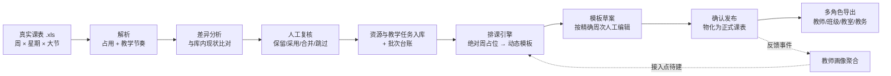
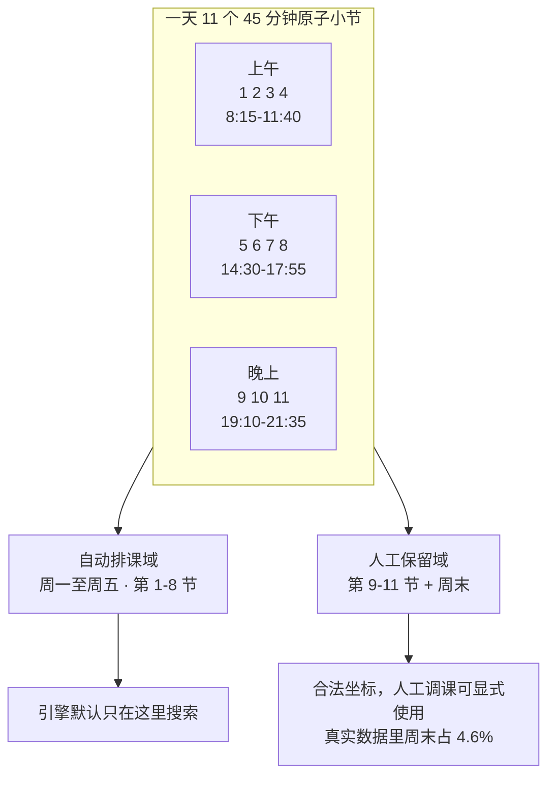
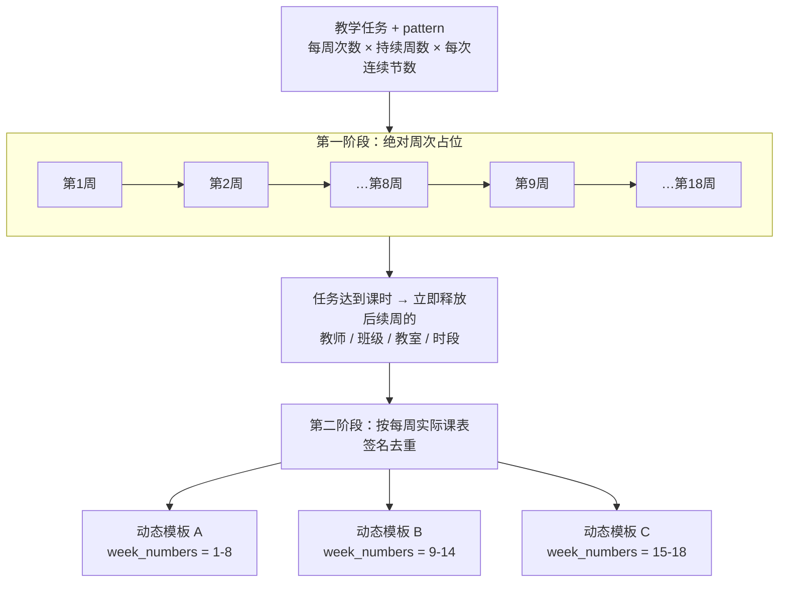
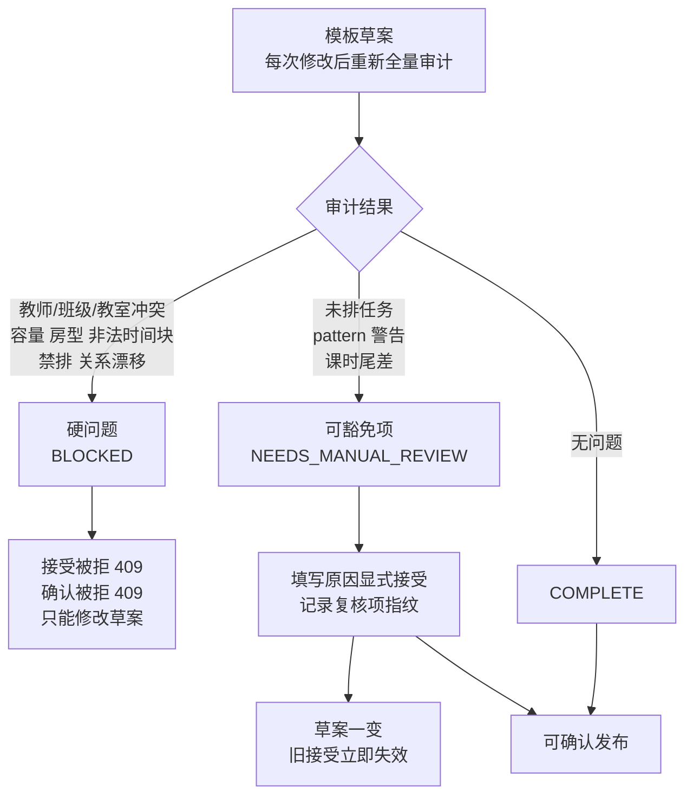
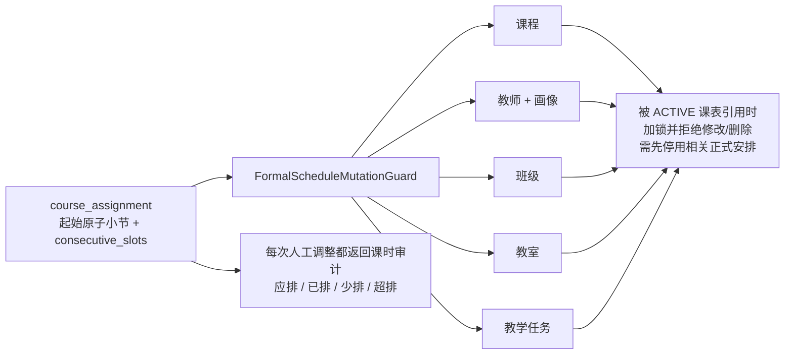
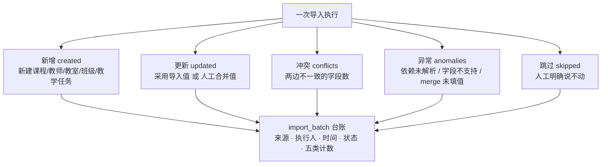

# 核心图清单与 Mermaid 草稿

> 建立时间：2026-09-06
> 旧稿（GA / CP-SAT 口径）已归档到 `docs/archive/03-核心图清单与草图说明.md`
> 与 `docs/archive/04-核心图Mermaid草稿.md`。

下面六张图覆盖论文与答辩需要说清的全部机制。每张图都标注了它要回答的问题、
建议出现的位置，以及可直接使用的 Mermaid 源码。

---

## 图 1：总体技术路线

**回答**：这个系统从哪里开始、到哪里结束。**位置**：第 1 章 / PPT 第 2 页。

> 虚线是**尚未接通**的部分，答辩时要如实说明——画像目前不影响排课结果。

---

## 图 2：时间坐标

**回答**：为什么是 11 节，自动域和人工保留域怎么划分。**位置**：第 3 章。

---

## 图 3：动态周模板的派生（核心创新）

**回答**：为什么不用固定两阶段模板；"完成即释放"是什么意思。**位置**：第 5 章 / PPT 核心页。

> 要点：**先按绝对周保证正确性，再压缩为模板保证存储与查询效率**。模板数量由数据
> 决定，不固定为两张。第 8 周结束的课，它的位置能被第 9 周开始的课复用。

---

## 图 4：人工复核的边界

**回答**：哪些问题永不可豁免，可豁免项怎么留痕。**位置**：第 6 章 / PPT 亮点页。

---

## 图 5：正式课表的护栏

**回答**：发布之后系统怎么保证课表不被从背后改掉。**位置**：第 6 章。

---

## 图 6：导入的五类结果

**回答**：导入怎么做到"不静默覆盖"。**位置**：第 4 章。

> 要点：**跳过与异常必须分开**。跳过是人的决定，异常是系统没做到；混成一类，
> 异常就被跳过盖住了。

---

## 建议的图文分工

| 位置 | 用哪几张 |
|---|---|
| 论文第 1 章 | 图 1 |
| 论文第 3 章 | 图 2 |
| 论文第 4 章 | 图 6 |
| 论文第 5 章 | 图 3 |
| 论文第 6 章 | 图 4、图 5 |
| 答辩 PPT | 图 1（开场）→ 图 3（核心创新）→ 图 4（工程严谨性）→ 演示录屏 |

Mermaid 可直接在支持的编辑器里导出 PNG/SVG，也可改画成 draw.io 或 PPT 图形。
